# Claude Agent SDK TypeScript 源码分析报告

## 1. 项目概述

### 1.1 基本信息

| 项目属性 | 详情 |
|---------|------|
| **项目名称** | @anthropic-ai/claude-agent-sdk |
| **仓库地址** | https://github.com/anthropics/claude-agent-sdk-typescript |
| **包管理** | npm (原 Claude Code SDK) |
| **Node.js版本** | 18+ |
| **当前版本** | 0.2.101 |
| **语言** | TypeScript |
| **官方文档** | https://docs.claude.com/en/api/agent-sdk/overview |

### 1.2 核心定位

Claude Agent SDK 是 Anthropic 官方提供的 TypeScript/Python 库，用于**程序化构建 AI 代理**。它封装了 Claude Code CLI 的全部能力，使开发者可以：

- 创建自主代理理解代码库
- 编辑文件、运行命令
- 执行复杂工作流
- 构建生产级 AI 应用

### 1.3 技术栈架构图

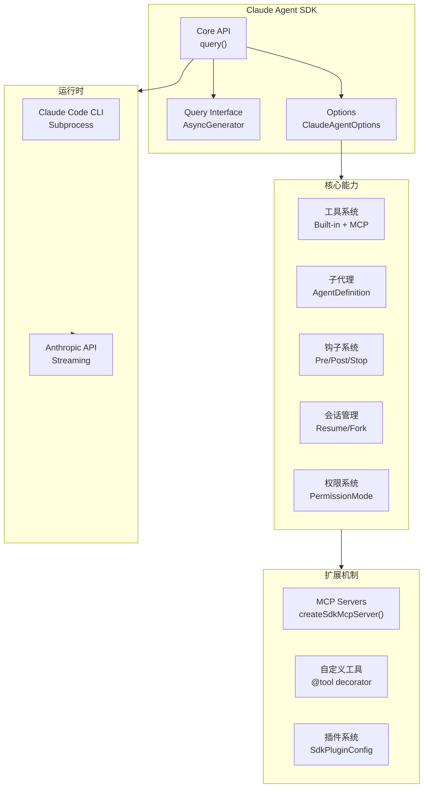

## 2. 核心架构设计

### 2.1 整体架构图

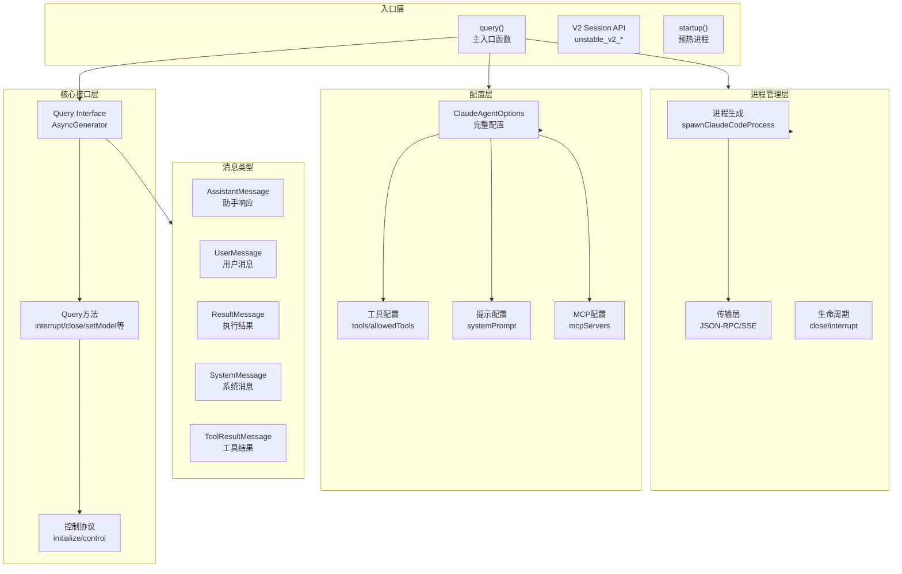

### 2.2 版本演进历程

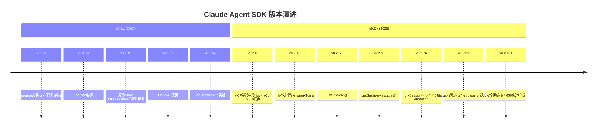

## 3. Query 接口详解

### 3.1 Query Interface 定义

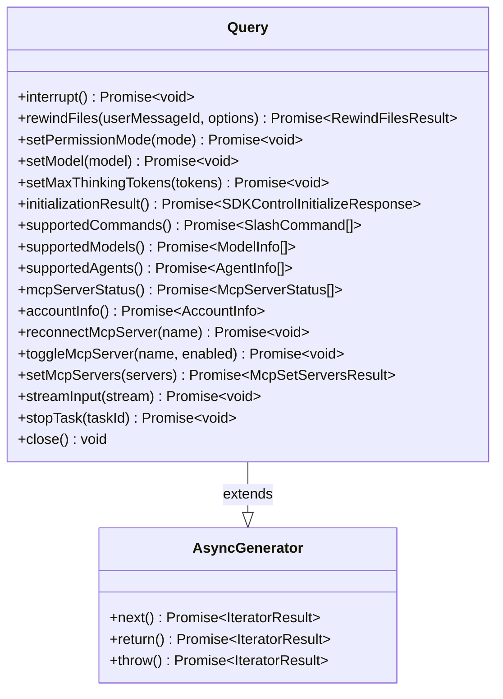

### 3.2 Query 方法分类

| 方法类别 | 方法名 | 功能 |
|---------|-------|------|
| **中断控制** | `interrupt()` | 强制中断当前查询 |
| | `close()` | 关闭查询并清理资源 |
| **文件管理** | `rewindFiles()` | 回滚文件到指定状态 |
| **模型配置** | `setModel()` | 动态切换模型 |
| | `setMaxThinkingTokens()` | 设置思考token上限 |
| **权限管理** | `setPermissionMode()` | 设置权限模式 |
| **能力查询** | `supportedCommands()` | 获取可用斜杠命令 |
| | `supportedModels()` | 获取可用模型列表 |
| | `supportedAgents()` | 获取可用子代理列表 |
| | `mcpServerStatus()` | 获取MCP服务器状态 |
| | `accountInfo()` | 获取账户信息 |
| **MCP管理** | `reconnectMcpServer()` | 重连MCP服务器 |
| | `toggleMcpServer()` | 启用/禁用MCP服务器 |
| | `setMcpServers()` | 动态设置MCP服务器 |
| **任务管理** | `stopTask()` | 停止运行中的任务 |
| | `streamInput()` | 流式输入用户消息 |

### 3.3 Query 执行流程

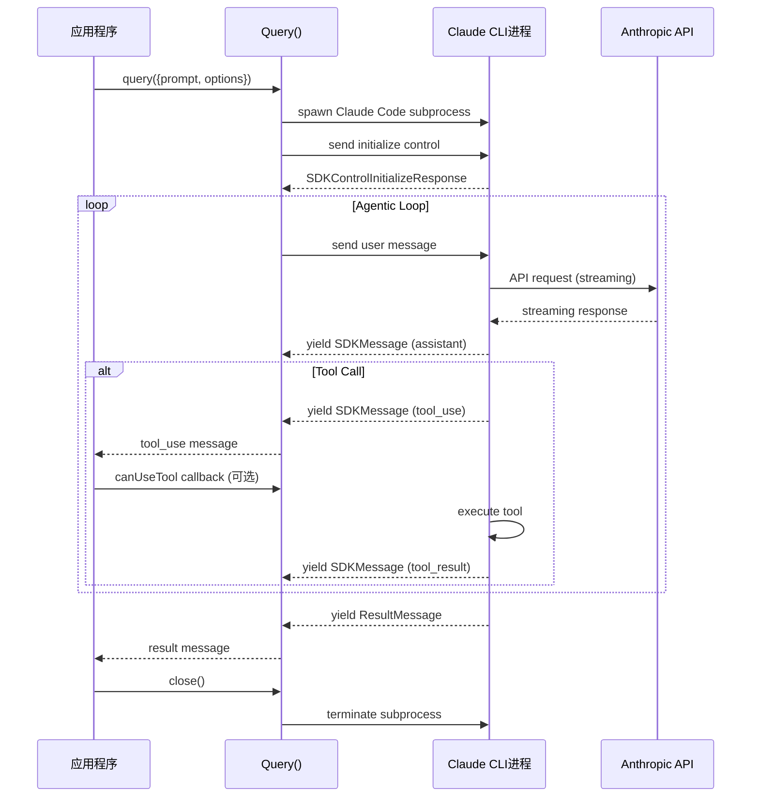

## 4. 配置系统详解

### 4.1 ClaudeAgentOptions 配置结构

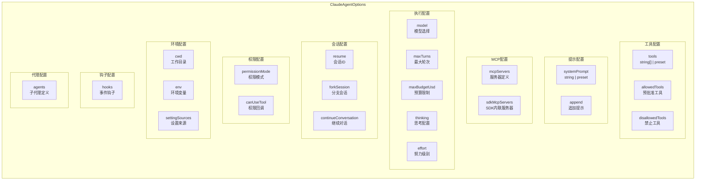

### 4.2 配置参数详解

#### 工具配置

| 参数 | 类型 | 默认值 | 说明 |
|------|------|--------|------|
| `tools` | `string[] \| {type:'preset', preset:'claude_code'}` | undefined | 可用工具列表或预设 |
| `allowedTools` | `string[]` | [] | 预批准工具（无需权限提示） |
| `disallowedTools` | `string[]` | [] | 禁止使用的工具 |

#### 系统提示配置

| 参数 | 类型 | 默认值 | 说明 |
|------|------|--------|------|
| `systemPrompt` | `string \| {type:'preset', preset:'claude_code', append?:string}` | undefined | 自定义提示或预设 |
| - | `{type:'preset', preset:'claude_code'}` | - | 使用Claude Code默认提示 |
| - | `{..., append:'额外指令'}` | - | 扩展默认提示 |

#### MCP服务器配置

| 参数 | 类型 | 说明 |
|------|------|------|
| `mcpServers` | `Record<string, McpServerConfig>` | MCP服务器配置字典 |
| `McpServerConfig.type` | `'stdio' \| 'sse' \| 'http'` | 传输类型 |
| `McpServerConfig.command` | `string` | stdio模式命令 |
| `McpServerConfig.url` | `string` | http/sse模式URL |

#### 执行约束配置

| 参数 | 类型 | 说明 |
|------|------|------|
| `maxTurns` | `number` | 最大代理轮次（API往返次数） |
| `maxBudgetUsd` | `number` | 最大预算（美元） |
| `taskBudget` | `{total: number}` | API侧token预算 |
| `thinking` | `ThinkingConfig` | 思考模式配置 |
| `effort` | `'low' \| 'medium' \| 'high' \| 'max'` | 执行努力级别 |

## 5. 工具系统架构

### 5.1 内置工具列表

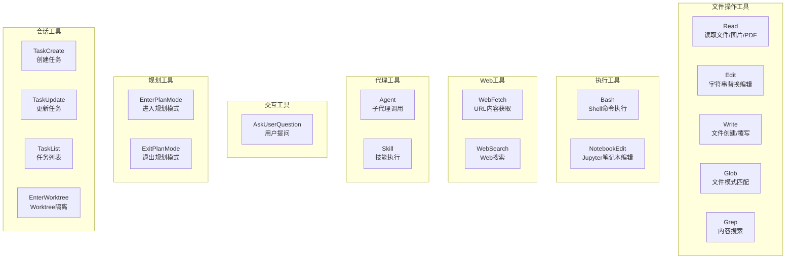

### 5.2 自定义工具创建流程

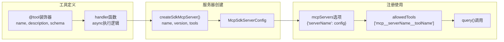

### 5.3 自定义工具代码示例

```typescript
import { tool, createSdkMcpServer } from "@anthropic-ai/claude-agent-sdk";
import { z } from "zod";

// 定义工具：名称、描述、输入Schema、处理函数
const getTemperature = tool(
  "get_temperature",
  "Get the current temperature at a location",
  {
    latitude: z.number().describe("Latitude coordinate"),
    longitude: z.number().describe("Longitude coordinate")
  },
  async (args) => {
    // args 类型从 schema 推断: { latitude: number; longitude: number }
    const response = await fetch(
      `https://api.open-meteo.com/v1/forecast?` +
      `latitude=${args.latitude}&longitude=${args.longitude}` +
      `&current=temperature_2m&temperature_unit=fahrenheit`
    );
    const data = await response.json();
    
    // 返回 content 数组 - Claude 看到的是工具结果
    return {
      content: [
        { type: "text", text: `Temperature: ${data.current.temperature_2m}°F` }
      ]
    };
  }
);

// 包装成 MCP 服务器
const weatherServer = createSdkMcpServer({
  name: "weather",
  version: "1.0.0",
  tools: [getTemperature]
});

// 在 query 中使用
for await (const message of query({
  prompt: "What's the temperature in San Francisco?",
  options: {
    mcpServers: { weather: weatherServer },
    allowedTools: ["mcp__weather__get_temperature"]
  }
})) {
  if ("result" in message) console.log(message.result);
}
```

## 6. 子代理系统

### 6.1 子代理架构图

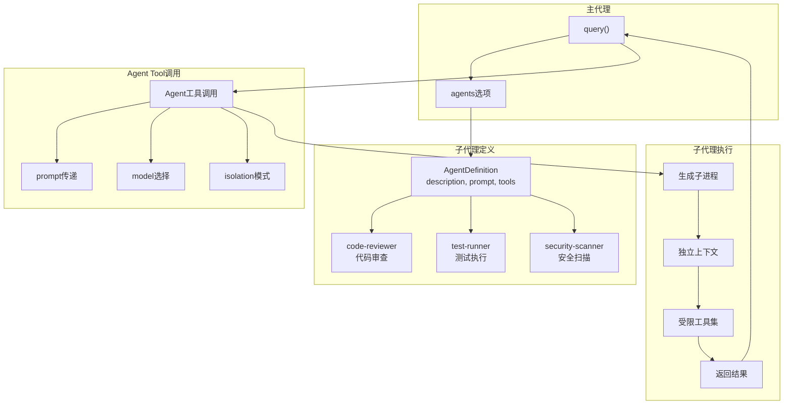

### 6.2 AgentDefinition 类型定义

```typescript
type AgentDefinition = {
  description: string;              // 必需：何时使用此代理的描述
  prompt: string;                   // 必需：代理的系统提示
  tools?: string[];                 // 可选：允许的工具列表
  disallowedTools?: string[];       // 可选：禁止的工具列表
  model?: "sonnet" | "opus" | "haiku" | "inherit";  // 可选：模型选择
  mcpServers?: AgentMcpServerSpec[]; // 可选：MCP服务器
  skills?: string[];                // 可选：预加载技能
  maxTurns?: number;                // 可选：最大轮次
  criticalSystemReminder_EXPERIMENTAL?: string;  // 实验：关键提醒
};
```

### 6.3 子代理使用示例

```typescript
import { query } from "@anthropic-ai/claude-agent-sdk";

for await (const message of query({
  prompt: "Review the authentication module for security issues",
  options: {
    allowedTools: ["Read", "Grep", "Glob", "Agent"],
    agents: {
      "code-reviewer": {
        description: "Expert code review specialist.",
        prompt: `You are a code review specialist with expertise in security.
                 Identify security vulnerabilities.
                 Check for performance issues.
                 Suggest specific improvements.`,
        tools: ["Read", "Grep", "Glob"],  // 只读工具
        model: "sonnet"
      },
      "test-runner": {
        description: "Runs and analyzes test suites.",
        prompt: `You are a test execution specialist.
                 Run tests and analyze results.`,
        tools: ["Bash", "Read", "Grep"],  // 可执行命令
        model: "haiku"  // 使用更快模型
      }
    }
  }
})) {
  if ("result" in message) console.log(message.result);
}
```

## 7. 钩子系统

### 7.1 钩子事件类型

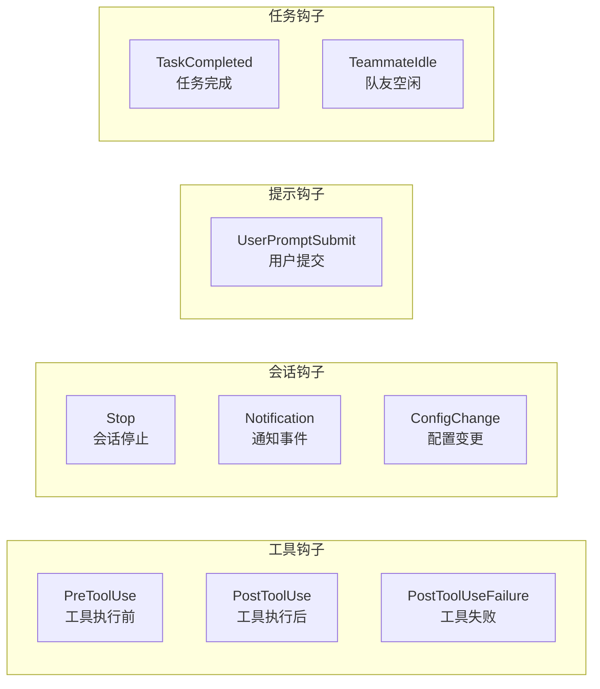

### 7.2 钩子配置结构

```typescript
type HooksConfig = {
  [hookEventName: string]: HookMatcher[];
};

type HookMatcher = {
  matcher?: string;     // 正则模式过滤工具名
  hooks: HookCallback[]; // 回调函数数组
  timeout?: number;     // 超时秒数
};

type HookCallback = (
  input: HookInput,
  toolUseId: string | null,
  context: HookContext
) => Promise<HookOutput>;
```

### 7.3 PreToolUse 钩子流程

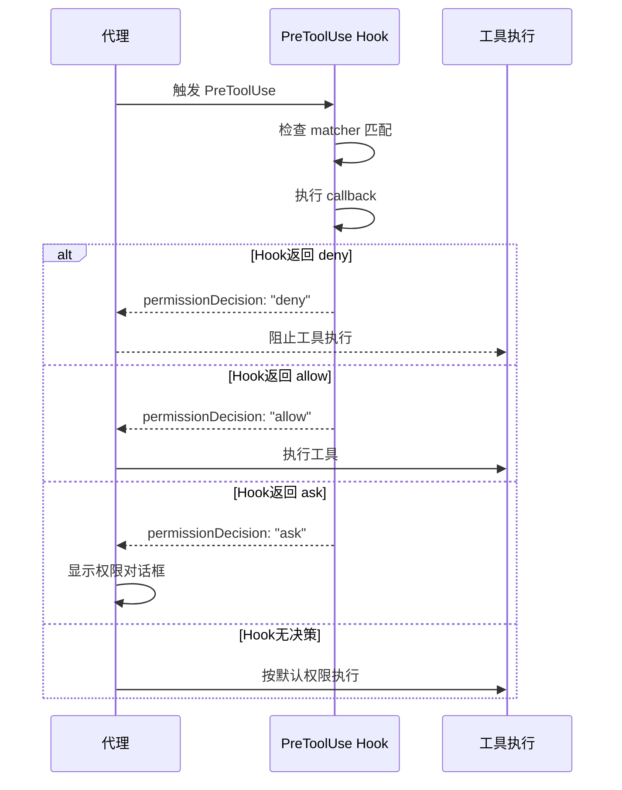

### 7.4 钩子使用示例

```typescript
for await (const message of query({
  prompt: "List files in current directory",
  options: {
    allowedTools: ["Read", "Write", "Bash"],
    hooks: {
      PreToolUse: [
        {
          matcher: "Bash",
          hooks: [async (input) => {
            const toolName = input.tool_name;
            const toolInput = input.tool_input;
            
            // 阻止危险命令
            if (toolInput?.command?.includes("rm -rf")) {
              return {
                hookSpecificOutput: {
                  hookEventName: "PreToolUse",
                  permissionDecision: "deny",
                  permissionDecisionReason: "Dangerous command blocked"
                }
              };
            }
            return {};
          }]
        }
      ],
      PostToolUse: [
        {
          hooks: [async (input) => {
            console.log(`[POST] Tool ${input.tool_name} completed`);
            return {};
          }]
        }
      ]
    }
  }
})) {
  console.log(message);
}
```

## 8. 会话管理系统

### 8.1 会话生命周期

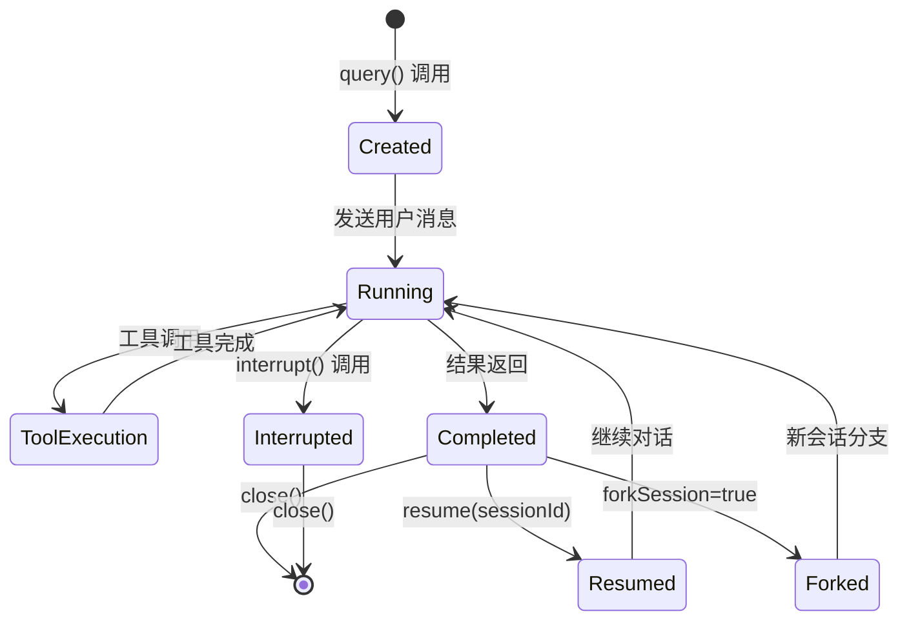

### 8.2 会话管理API

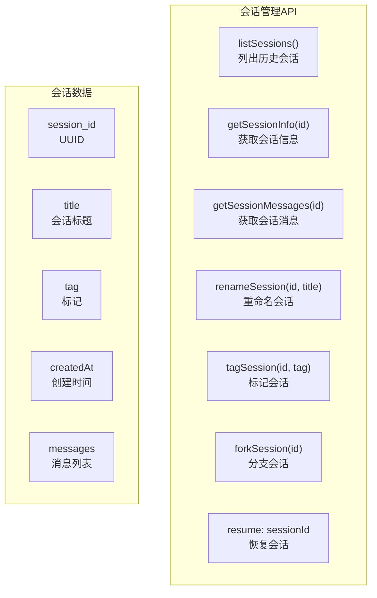

### 8.3 会话恢复与分支示例

```typescript
import { query } from "@anthropic-ai/claude-agent-sdk";

let sessionId: string | undefined;

// 第一次查询：捕获 session ID
for await (const message of query({
  prompt: "Read the authentication module",
  options: { allowedTools: ["Read", "Glob"] }
})) {
  if (message.type === "system" && message.subtype === "init") {
    sessionId = message.session_id;
  }
}

// 恢复会话：保持完整上下文
for await (const message of query({
  prompt: "Now find all places that call it",
  options: { resume: sessionId }
})) {
  if ("result" in message) console.log(message.result);
}

// 分支会话：探索不同方案
let forkedId: string | undefined;
for await (const message of query({
  prompt: "Instead of JWT, implement OAuth2",
  options: { resume: sessionId, forkSession: true }
})) {
  if (message.type === "system" && message.subtype === "init") {
    forkedId = message.session_id;
  }
}

// 原会话不受影响，继续JWT方案
for await (const message of query({
  prompt: "Continue with the JWT approach",
  options: { resume: sessionId }
})) {
  if ("result" in message) console.log(message.result);
}
```

## 9. 权限系统

### 9.1 权限模式

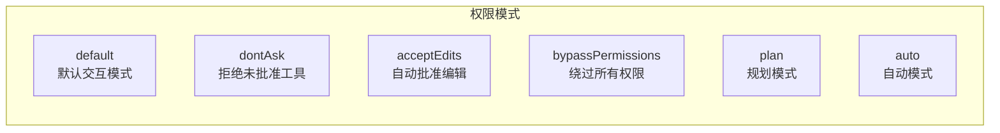

### 9.2 权限模式说明

| 模式 | 行为 |
|------|------|
| `default` | 未批准工具显示权限对话框 |
| `dontAsk` | 未批准工具自动拒绝（适合CI/CD） |
| `acceptEdits` | 自动批准 Edit/Write 操作 |
| `bypassPermissions` | 绕过所有权限检查（仅限信任环境） |
| `plan` | 进入规划模式 |
| `auto` | 基于规则自动决策 |

### 9.3 canUseTool 回调

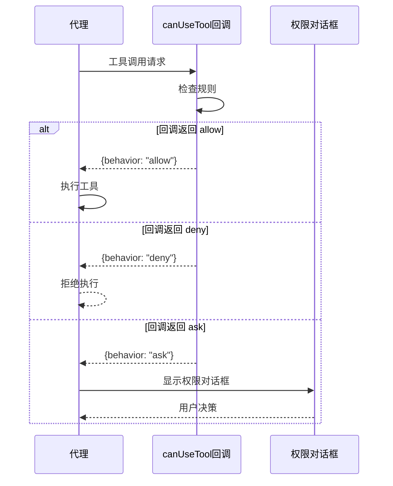

## 10. MCP集成

### 10.1 MCP服务器配置类型

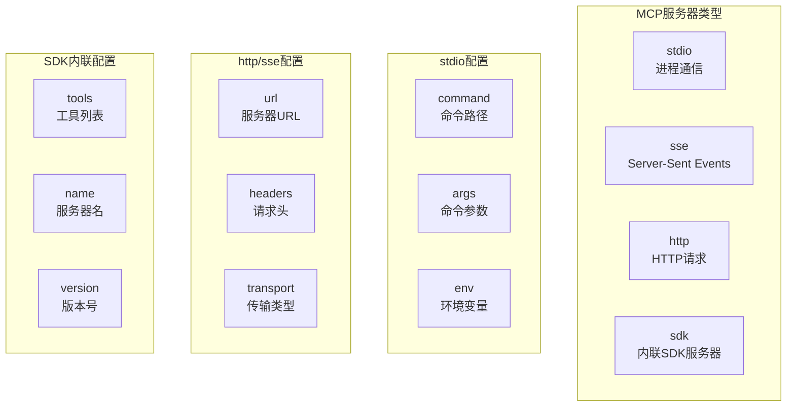

### 10.2 MCP服务器状态管理

| 方法 | 功能 |
|------|------|
| `mcpServerStatus()` | 获取所有MCP服务器状态 |
| `reconnectMcpServer(name)` | 重连指定服务器 |
| `toggleMcpServer(name, enabled)` | 启用/禁用服务器 |
| `setMcpServers(servers)` | 动态设置服务器配置 |
| `enableChannel()` | 激活MCP通道 |

### 10.3 MCP工具命名规则

```typescript
// MCP工具命名格式: mcp__<serverName>__<toolName>
// 示例:
allowedTools: [
  "mcp__weather__get_temperature",
  "mcp__utils__calculate",
  "mcp__enterprise-tools__*"  // 通配符批准所有工具
]
```

## 11. 消息类型系统

### 11.1 SDK消息类型层次

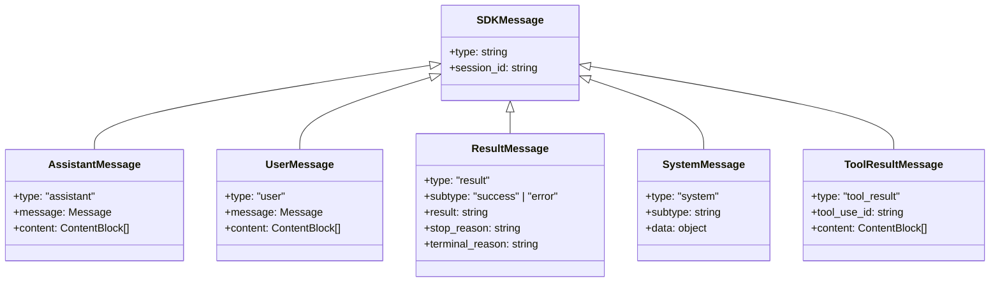

### 11.2 SystemMessage子类型

| subtype | 说明 |
|---------|------|
| `init` | 会话初始化（包含session_id） |
| `compact_boundary` | 上下文压缩边界 |
| `task_progress` | 任务进度更新 |
| `task_notification` | 任务完成通知 |
| `hook_progress` | Hook执行进度 |
| `hook_response` | Hook响应 |
| `api_retry` | API重试事件 |
| `session_state_changed` | 会话状态变更 |
| `mcp_connection` | MCP连接事件 |

## 12. 设计模式总结

### 12.1 核心设计模式

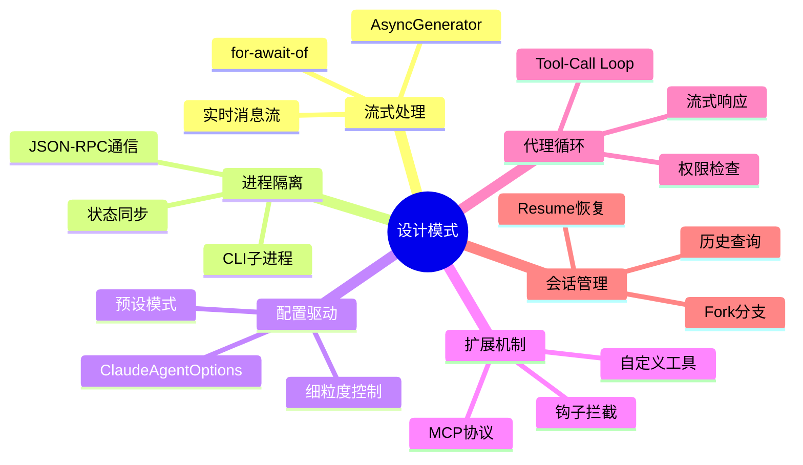

### 12.2 SDK vs CLI 对比

| 特性 | Claude Code CLI | Claude Agent SDK |
|------|----------------|------------------|
| **交互方式** | 命令行交互 | 程序化API |
| **消息处理** | 终端渲染 | 流式消息 |
| **权限控制** | 用户对话框 | canUseTool回调 |
| **配置方式** | CLI参数/配置文件 | ClaudeAgentOptions |
| **自定义工具** | MCP配置文件 | createSdkMcpServer() |
| **会话管理** | --resume参数 | resume/forkSession选项 |
| **适用场景** | 交互式开发 | 自动化/生产应用 |

## 13. 使用最佳实践

### 13.1 基础使用模式

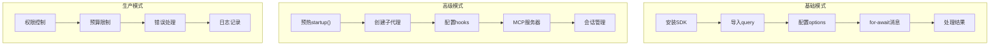

### 13.2 性能优化建议

| 建议 | 方法 |
|------|------|
| **预热进程** | 使用 `startup()` 提前初始化 |
| **工具筛选** | 使用 `tools` 限制可用工具 |
| **预批准** | 使用 `allowedTools` 减少权限提示 |
| **预算控制** | 使用 `maxBudgetUsd` 和 `taskBudget` |
| **模型选择** | 子代理使用 `haiku` 加速简单任务 |

### 13.3 安全最佳实践

| 建议 | 方法 |
|------|------|
| **权限限制** | 使用 `permissionMode: "dontAsk"` |
| **工具白名单** | 明确指定 `allowedTools` |
| **钩子拦截** | PreToolUse hook 阻止危险操作 |
| **沙箱执行** | 配置 `sandbox` 选项 |
| **设置隔离** | 不加载用户设置 `settingSources: []` |

---

## 附录：Mermaid图表索引

1. **技术栈架构图** - SDK整体技术层次
2. **整体架构图** - 核心模块关系
3. **版本演进时间线** - SDK发展历程
4. **Query Interface类图** - Query方法定义
5. **Query执行流程** - SequenceDiagram展示调用
6. **ClaudeAgentOptions配置结构** - Flowchart展示配置
7. **内置工具列表** - 工具分类图
8. **自定义工具创建流程** - 工具定义步骤
9. **子代理架构图** - 代理系统结构
10. **钩子事件类型** - Hook分类
11. **PreToolUse钩子流程** - 权限拦截SequenceDiagram
12. **会话生命周期** - StateDiagram状态转换
13. **会话管理API** - API功能图
14. **权限模式** - PermissionMode分类
15. **canUseTool回调流程** - 权限决策SequenceDiagram
16. **MCP服务器配置类型** - MCP配置分类
17. **SDK消息类型层次** - ClassDiagram消息类型
18. **核心设计模式思维导图** - Mindmap设计模式
19. **使用模式流程** - 最佳实践流程

---

*报告生成日期: 2026-04-11*
*分析版本: Claude Agent SDK v0.2.101*
*文档来源: GitHub仓库 + Context7官方文档*