# Claude Code 源码设计与实现分析报告

## 1. 项目概述

### 1.1 基本信息

| 项目属性 | 详情 |
|---------|------|
| **项目类型** | CLI 终端应用 |
| **运行时** | Bun (Node.js 兼容) |
| **语言** | TypeScript (严格模式) |
| **UI框架** | React + Ink (终端UI) |
| **CLI解析** | Commander.js |
| **验证** | Zod v4 |
| **特性标志** | GrowthBook + bun:bundle DCE |
| **API SDK** | Anthropic SDK |
| **遥测** | OpenTelemetry + gRPC |
| **代码规模** | 1,902 源文件, 512,000+ 行代码 |

### 1.2 技术栈架构图

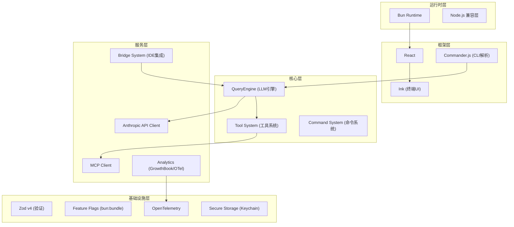

## 2. 核心架构设计

### 2.1 整体架构图

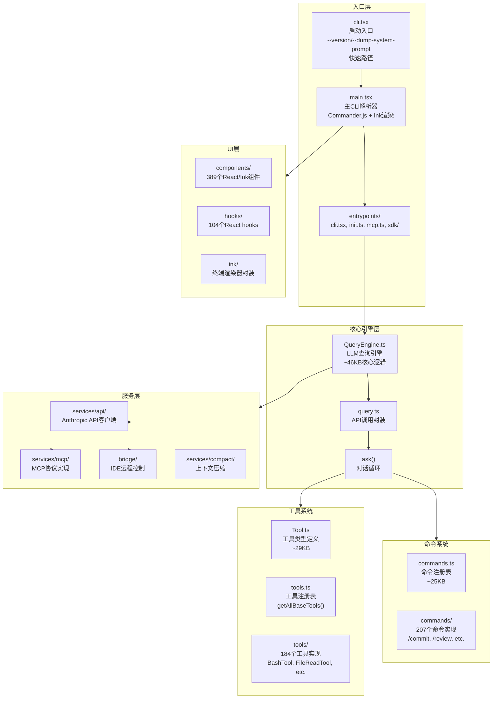

### 2.2 模块文件分布

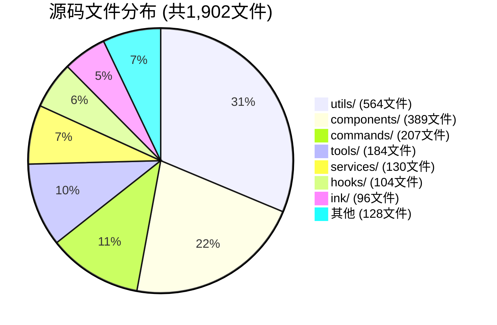

### 2.3 核心目录结构

```
src/
├── main.tsx                 # 主CLI入口 (Commander.js + Ink渲染)
├── commands.ts              # 命令注册表 (~25KB)
├── tools.ts                 # 工具注册表
├── Tool.ts                  # 工具类型定义 (~29KB)
├── QueryEngine.ts           # LLM查询引擎 (~46KB)
├── query.ts                 # API调用封装
│
├── entrypoints/             # 入口点模块
│   ├── cli.tsx              # 启动入口 (快速路径处理)
│   ├── init.ts              # 初始化逻辑
│   ├── mcp.ts               # MCP服务入口
│   └── sdk/                 # SDK类型导出
│
├── tools/                   # 工具实现 (184文件)
│   ├── BashTool/            # Shell命令执行
│   ├── FileReadTool/        # 文件/图片/PDF读取
│   ├── FileEditTool/        # 字符替换编辑
│   ├── FileWriteTool/       # 文件创建/覆写
│   ├── GlobTool/            # 文件模式匹配
│   ├── GrepTool/            # ripgrep内容搜索
│   ├── WebFetchTool/        # URL内容获取
│   ├── WebSearchTool/       # Web搜索
│   ├── AgentTool/           # 子代理生成
│   ├── SkillTool/           # 技能执行
│   ├── MCPTool/             # MCP服务调用
│   ├── TaskCreateTool/      # 任务生命周期管理
│   ├── EnterPlanModeTool/   # 规划模式切换
│   └── EnterWorktreeTool/   # Git worktree隔离
│
├── commands/                # 命令实现 (207文件)
│   ├── commit/              # /commit 命令
│   ├── review/              # /review 命令
│   ├── compact/             # /compact 命令
│   ├── mcp/                 # /mcp 命令
│   ├── doctor/              # /doctor 命令
│   └── ...
│
├── services/                # 服务层 (130文件)
│   ├── api/                 # Anthropic API客户端
│   ├── mcp/                 # MCP协议实现
│   ├── oauth/               # OAuth认证
│   ├── lsp/                 # Language Server Protocol
│   ├── compact/             # 上下文压缩
│   ├── analytics/           # GrowthBook/遥测
│   └── policyLimits/        # 组织策略限制
│
├── bridge/                  # IDE远程控制 (31文件)
│   ├── bridgeMain.ts        # Bridge主循环
│   ├── bridgeMessaging.ts   # 消息协议
│   ├── replBridge.ts        # REPL会话桥接
│   ├── jwtUtils.ts          # JWT认证
│   └── sessionRunner.ts     # 会话执行
│
├── components/              # UI组件 (389文件)
│   ├── PromptInput/         # 用户输入组件
│   ├── Settings/            # 设置对话框
│   ├── Spinner/             # 加载指示器
│   ├── messages/            # 消息显示
│   ├── permissions/         # 权限请求对话框
│   └── design-system/       # 可复用UI原语
│
├── hooks/                   # React hooks (104文件)
│   ├── useCanUseTool.ts     # 工具权限检查
│   ├── useSwarmInitialization.ts # 代理集群初始化
│   └── toolPermission/      # 权限处理器
│
├── ink/                     # Ink渲染器封装 (96文件)
│   ├── dom.ts               # DOM操作
│   ├── layout/              # Yoga布局引擎
│   ├── output.ts            # 输出渲染
│   └── termio.ts            # 终端I/O
│
├── utils/                   # 工具函数 (564文件)
│   ├── bash/                # Shell工具
│   ├── git/                 # Git操作
│   ├── github/              # GitHub集成
│   ├── mcp/                 # MCP工具
│   ├── model/               # 模型选择/成本
│   ├── permissions/         # 权限工具
│   ├── sandbox/             # 沙箱执行
│   ├── secureStorage/       # 密钥存储
│   ├── settings/            # 设置管理
│   ├── telemetry/           # 遥测
│   └── swarm/               # 代理集群
│
├── state/                   # 全局状态 (6文件)
├── types/                   # 类型定义 (11文件)
├── skills/                  # 内置技能 (20文件)
├── tasks/                   # 任务类型 (12文件)
└── constants/               # 常量 (21文件)
```

## 3. 核心组件深度分析

### 3.1 QueryEngine 查询引擎

**QueryEngine 是 Claude Code 的核心引擎，负责管理整个对话生命周期和 LLM API 调用。**

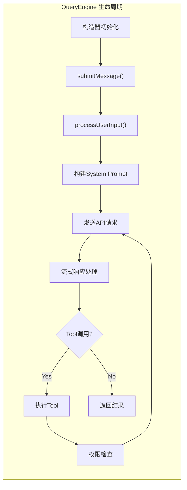

**核心职责：**

| 职责 | 描述 |
|------|------|
| **会话状态管理** | 管理 messages, fileCache, usage 等会话状态 |
| **Tool-Call循环** | 实现 Agent 循环: LLM响应 → Tool执行 → 下次LLM调用 |
| **流式响应处理** | 处理 Anthropic API 的流式响应 |
| **权限检查** | 在每个 Tool 调用时进行权限验证 |
| **上下文压缩** | 触发 compact 操作压缩对话历史 |
| **成本跟踪** | Token计数和费用计算 |
| **重试逻辑** | 处理 API 错误的重试机制 |

**QueryEngineConfig 配置结构：**

```typescript
type QueryEngineConfig = {
  cwd: string                    // 工作目录
  tools: Tools                   // 工具列表
  commands: Command[]            // 命令列表
  mcpClients: MCPServerConnection[] // MCP客户端
  agents: AgentDefinition[]      // 代理定义
  canUseTool: CanUseToolFn       // 权限检查函数
  getAppState: () => AppState    // 状态获取
  setAppState: (f) => void       // 状态更新
  initialMessages?: Message[]    // 初始消息
  readFileCache: FileStateCache  // 文件读取缓存
  customSystemPrompt?: string    // 自定义系统提示
  appendSystemPrompt?: string    //追加系统提示
  userSpecifiedModel?: string    // 用户指定模型
  thinkingConfig?: ThinkingConfig // 思考模式配置
  maxTurns?: number              // 最大轮次
  maxBudgetUsd?: number          // 最大预算
  abortController?: AbortController // 中断控制
}
```

### 3.2 Tool 系统架构

**工具系统采用模块化设计，每个工具是独立的功能单元。**

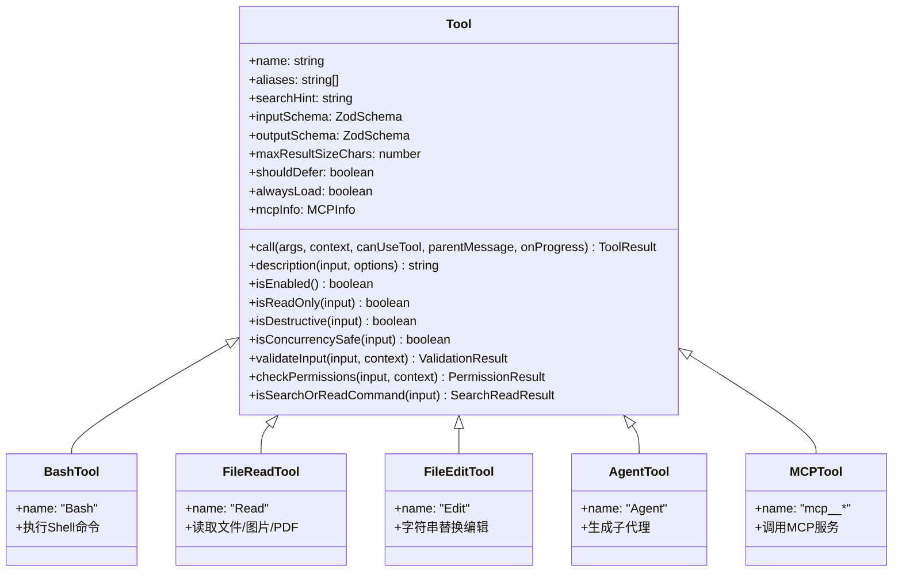

**Tool 接口核心方法：**

```typescript
interface Tool<Input, Output, Progress> {
  // 基础属性
  name: string                    // 工具名称
  aliases?: string[]              // 别名列表
  searchHint?: string             // 搜索提示 (ToolSearch用)
  inputSchema: ZodSchema          // 输入验证
  outputSchema?: ZodSchema        // 输出验证
  maxResultSizeChars: number      // 结果大小限制
  
  // 执行方法
  call(args, context, canUseTool, parentMessage, onProgress): Promise<ToolResult<Output>>
  description(input, options): Promise<string>
  
  // 状态判断
  isEnabled(): boolean
  isReadOnly(input): boolean
  isDestructive?(input): boolean
  isConcurrencySafe(input): boolean
  
  // 权限验证
  validateInput?(input, context): Promise<ValidationResult>
  checkPermissions?(input, context): Promise<PermissionResult>
}
```

**工具注册流程：**

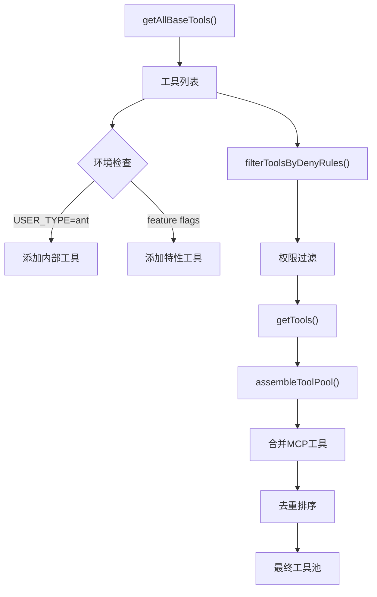

### 3.3 MCP 服务实现

**Model Context Protocol (MCP) 是 Claude Code 与外部服务集成的核心协议。**

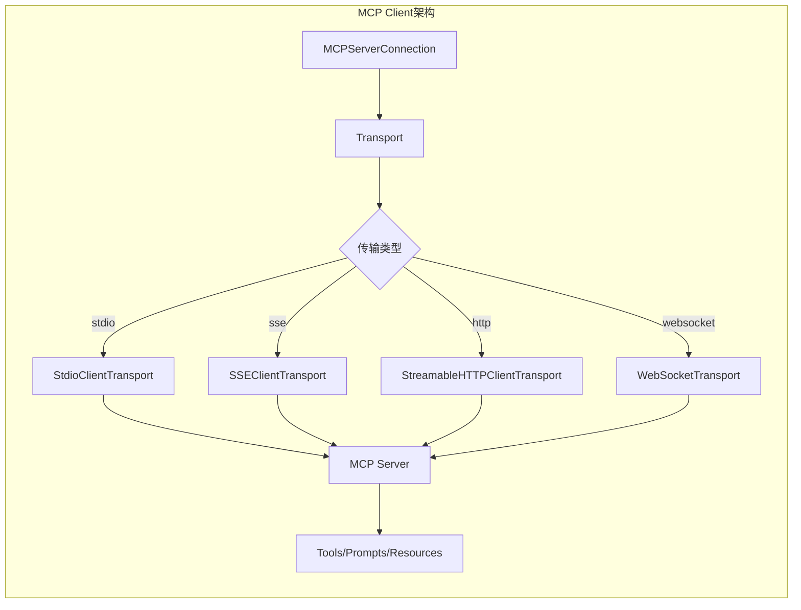

**MCP 核心组件：**

| 文件 | 功能 |
|------|------|
| `client.ts` | MCP客户端核心实现 |
| `types.ts` | MCP类型定义 |
| `config.ts` | MCP配置管理 |
| `auth.ts` | MCP认证处理 |
| `InProcessTransport.ts` | 进程内传输 |
| `SdkControlTransport.ts` | SDK控制传输 |
| `elicitationHandler.ts` | 交互请求处理 |

**MCP 工具调用流程：**

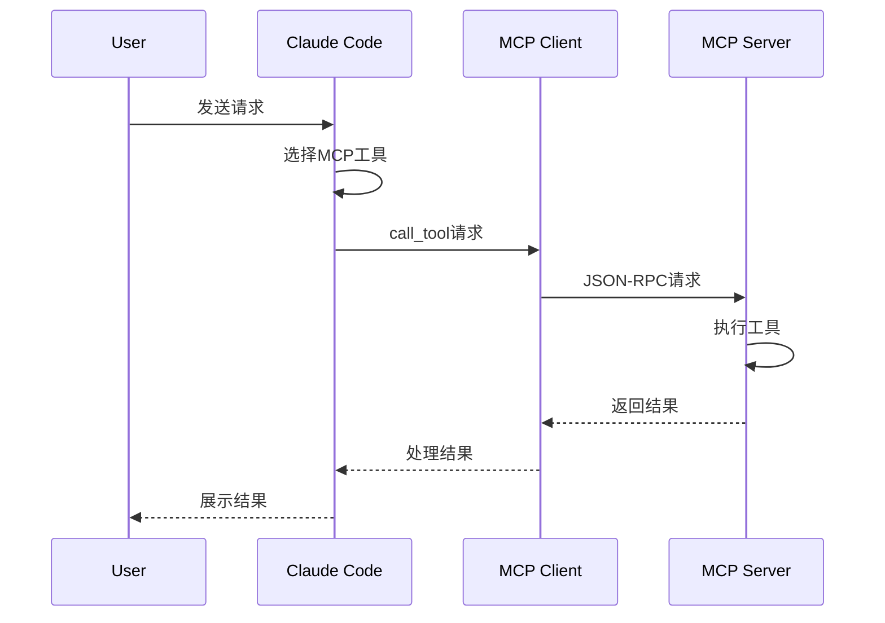

### 3.4 Bridge 系统 (IDE集成)

**Bridge 系统实现 IDE 扩展与 CLI 的双向通信。**

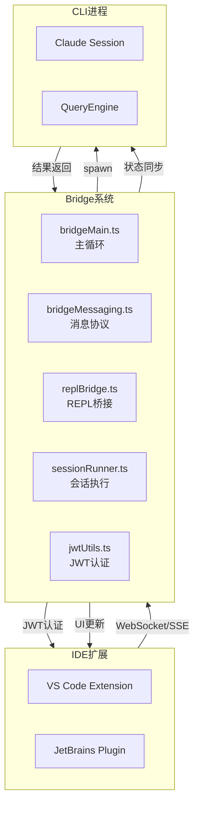

**Bridge 核心功能：**

| 功能 | 实现 |
|------|------|
| **会话管理** | 创建/销毁/恢复会话 |
| **远程控制** | IDE 控制本地 Claude 进程 |
| **状态同步** | 实时同步执行状态 |
| **权限处理** | IDE 侧权限请求 |
| **心跳维持** | 定期心跳保持连接 |

### 3.5 API 服务层

**Anthropic API 客户端实现。**

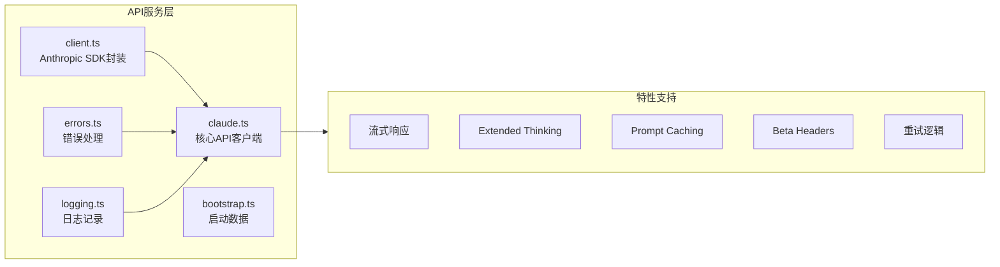

**API 调用关键参数：**

| 参数 | 作用 |
|------|------|
| `betas` | 启用 beta 功能 (thinking, caching, etc.) |
| `system` | 系统提示 (带缓存标记) |
| `tools` | 工具定义列表 |
| `messages` | 对话历史 |
| `max_tokens` | 最大输出 token |
| `stream` | 流式响应模式 |
| `thinking` | 思考模式配置 |

## 4. 启动流程分析

### 4.1 CLI启动序列

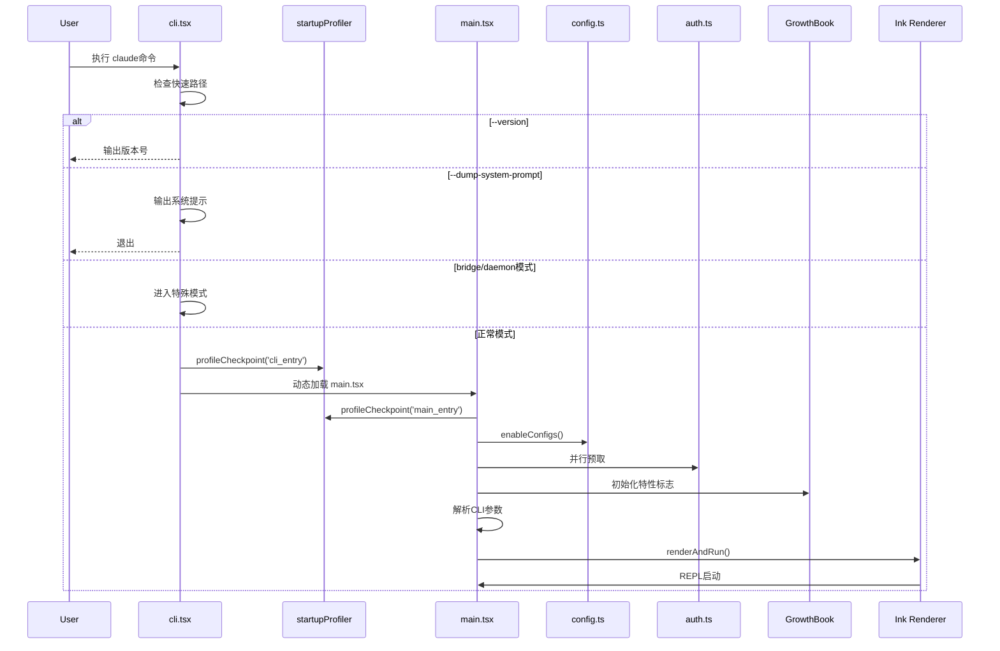

### 4.2 启动性能优化策略

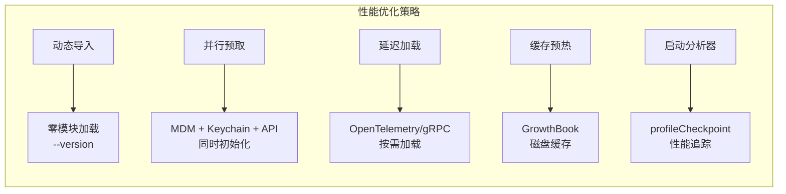

**关键优化点：**

| 优化策略 | 实现位置 | 效果 |
|---------|---------|------|
| **快速路径** | `cli.tsx` | --version 零模块加载 |
| **动态导入** | `cli.tsx` | 按需加载模块 |
| **并行预取** | `main.tsx` | MDM/keychain/API并行初始化 |
| **延迟加载** | 各模块 | OpenTelemetry/gRPC延迟加载 |
| **缓存预热** | `growthbook.ts` | 特性标志磁盘缓存 |

## 5. 权限系统设计

### 5.1 权限检查流程

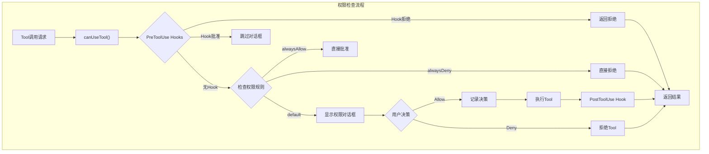

### 5.2 权限上下文结构

```typescript
type ToolPermissionContext = {
  mode: PermissionMode            // 'default' | 'auto' | 'bypass'
  additionalWorkingDirectories: Map<string, AdditionalWorkingDirectory>
  alwaysAllowRules: ToolPermissionRulesBySource  // 总是允许规则
  alwaysDenyRules: ToolPermissionRulesBySource   // 总是拒绝规则
  alwaysAskRules: ToolPermissionRulesBySource    // 总是询问规则
  isBypassPermissionsModeAvailable: boolean     // 是否可用绕过模式
  isAutoModeAvailable?: boolean                  // 自动模式可用性
  strippedDangerousRules?: ToolPermissionRulesBySource  //危险操作规则
  shouldAvoidPermissionPrompts?: boolean        // 避免提示(后台代理)
  awaitAutomatedChecksBeforeDialog?: boolean    // 等待自动化检查
  prePlanMode?: PermissionMode                   // Plan模式前权限模式
}
```

### 5.3 权限规则来源

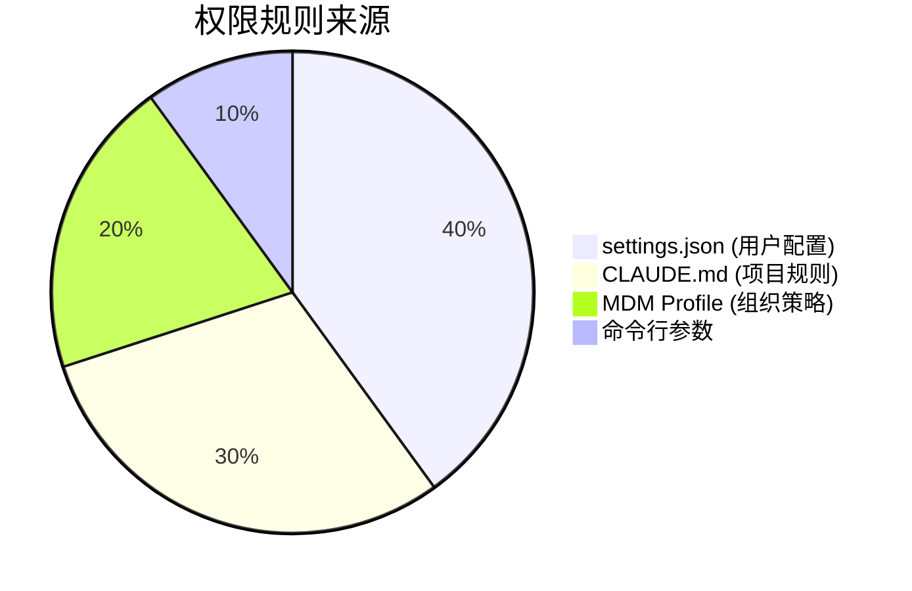

## 6. 特性标志系统

### 6.1 bun:bundle DCE机制

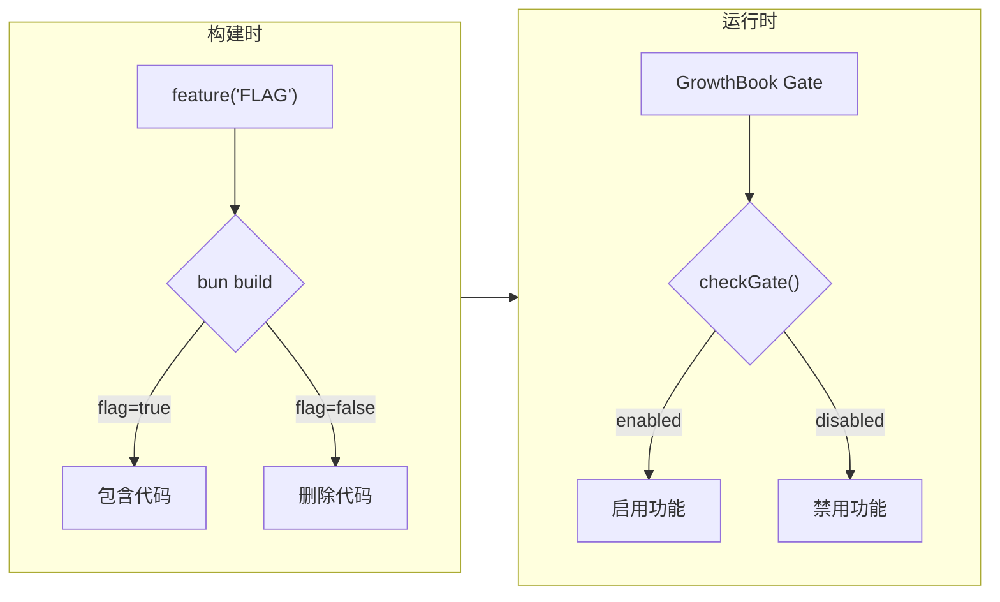

### 6.2 关键特性标志

| 特性标志 | 功能 |
|---------|------|
| `PROACTIVE` | 主动代理能力 |
| `KAIROS` | 助手模式 |
| `BRIDGE_MODE` | IDE远程控制 |
| `DAEMON` | 后台守护进程 |
| `VOICE_MODE` | 语音输入 |
| `AGENT_TRIGGERS` | 远程触发器 |
| `MONITOR_TOOL` | 监控工具 |
| `COORDINATOR_MODE` | 多代理协调 |
| `HISTORY_SNIP` |历史裁剪 |
| `WORKFLOW_SCRIPTS` | 工作流脚本 |
| `CHICAGO_MCP` | Computer Use MCP |

## 7. UI架构设计

### 7.1 React + Ink 组件树

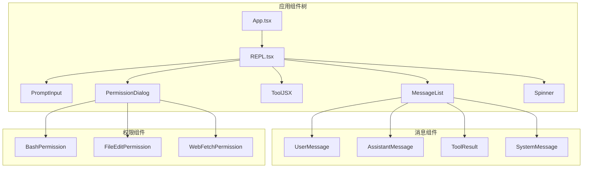

### 7.2 状态管理

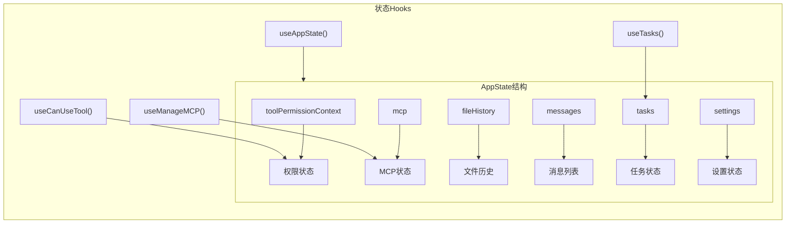

## 8. 任务系统

### 8.1 任务生命周期

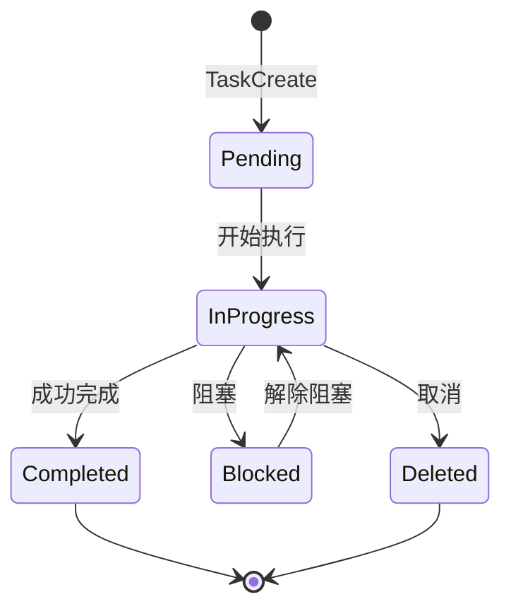

### 8.2 任务类型

| 任务类型 | 文件 | 用途 |
|---------|------|------|
| `LocalAgentTask` | `tasks/LocalAgentTask/` | 本地子代理任务 |
| `RemoteAgentTask` | `tasks/RemoteAgentTask/` | 远程代理任务 |
| `LocalShellTask` | `tasks/LocalShellTask/` | Shell命令任务 |
| `DreamTask` | `tasks/DreamTask/` | Dream任务 |
| `InProcessTeammateTask` | `tasks/InProcessTeammateTask/` | 进程内队友任务 |

## 9. 技能系统

### 9.1 技能架构

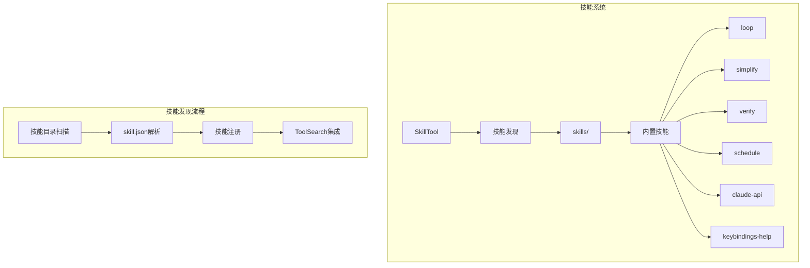

### 9.2 内置技能列表

| 技能 | 文件 | 功能 |
|------|------|------|
| `loop` | `skills/loop/` | 循环执行 |
| `simplify` | `skills/simplify/` | 代码简化 |
| `verify` | `skills/verify/` | 验证流程 |
| `schedule` | `skills/schedule/` | 远程调度 |
| `claude-api` | `skills/claude-api/` | API构建 |
| `keybindings-help` | `skills/keybindings-help/` | 键绑定帮助 |
| `remember` | `skills/remember/` | 记忆管理 |
| `stuck` | `skills/stuck/` | 卡住处理 |
| `debug` | `skills/debug/` | 调试辅助 |

## 10. 设计模式总结

### 10.1 核心设计模式

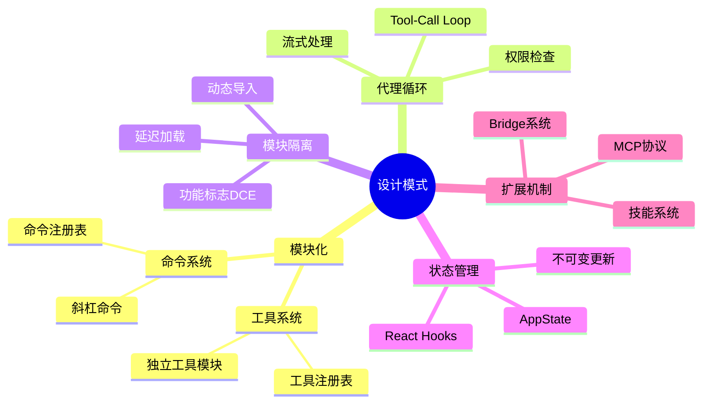

### 10.2 架构特点总结

| 特点 | 实现方式 |
|------|---------|
| **模块化** | 工具/命令独立目录，注册表模式 |
| **性能优化** | 快速路径、并行预取、延迟加载、缓存预热 |
| **可扩展性** | MCP协议、技能系统、代理系统 |
| **安全性** | 权限系统、沙箱执行、密钥管理 |
| **可观测性** | 遥测系统、启动分析器、日志系统 |
| **多模型支持** | 模型选择器、成本计算、beta headers |

## 11. 关键技术决策

### 11.1 技术选型理由

| 决策 | 理由 |
|------|------|
| **Bun Runtime** | 更快的启动速度，原生TypeScript支持 |
| **React + Ink** | 组件化UI，声明式渲染，跨平台 |
| **Zod v4** | 类型安全的验证，schema推断 |
| **GrowthBook** | 灵活的特性标志，A/B测试支持 |
| **bun:bundle DCE** | 构建时删除未使用代码，减少包大小 |
| **MCP Protocol** | 标准化服务集成，社区支持 |

### 11.2 架构权衡

```mermaid
graph LR
    subgraph Tradeoffs["架构权衡"]
        A["单文件系统Prompt<br/>VS<br/>模块化Prompt"] --> B["缓存优化优先"]
        C["内置工具<br/>VS<br/>MCP工具"] --> D["核心功能内置<br/>扩展用MCP"]
        E["同步权限<br/>VS<br/>异步权限"] --> F["用户体验优先<br/>后台可异步"]
        G["全量历史<br/>VS<br/>压缩历史"] --> H["内存优化优先<br/>UI保留全量"]
    end
```

## 12. 源码质量评估

### 12.1 代码组织评估

| 维度 | 评分 | 说明 |
|------|------|------|
| **模块化** | ★★★★★ | 工具/命令/服务独立模块 |
| **类型安全** | ★★★★★ | TypeScript严格模式，Zod验证 |
| **可测试性** | ★★★★☆ | 纯函数工具，但UI测试复杂 |
| **可扩展性** | ★★★★★ | MCP/技能/代理系统 |
| **文档** | ★★★★☆ | 类型注释完善，架构文档需补充 |

### 12.2 性能优化评估

| 优化项 | 实现程度 |
|--------|---------|
| 启动性能 | ★★★★★ 快速路径、动态导入 |
| 运行时性能 | ★★★★☆ 流式响应、缓存 |
| 内存管理 | ★★★★☆ 上下文压缩、LRU缓存 |
| 包大小 | ★★★★★ DCE、tree-shaking |

---

## 附录：Mermaid 图表索引

1. **技术栈架构图** - 展示整体技术层次
2. **整体架构图** - 展示核心模块关系
3. **源码文件分布** - Pie图展示文件分布
4. **QueryEngine生命周期** - Flowchart展示引擎流程
5. **Tool类图** - ClassDiagram展示工具继承
6. **工具注册流程** - Flowchart展示注册过程
7. **MCP Client架构** - Flowchart展示MCP结构
8. **MCP调用序列** - SequenceDiagram展示调用流程
9. **Bridge系统架构** - Flowchart展示IDE集成
10. **API服务层架构** - Flowchart展示API结构
11. **CLI启动序列** - SequenceDiagram展示启动流程
12. **性能优化策略** - Flowchart展示优化方法
13. **权限检查流程** - Flowchart展示权限逻辑
14. **bun:bundle DCE机制** - Flowchart展示DCE
15. **React + Ink组件树** - Flowchart展示UI结构
16. **任务生命周期** - StateDiagram展示任务状态
17. **技能架构** - Flowchart展示技能系统
18. **设计模式思维导图** - Mindmap展示设计模式
19. **架构权衡图** - Graph展示技术决策

---

*报告生成日期: 2026-04-11*
*分析版本: Claude Code源码快照*